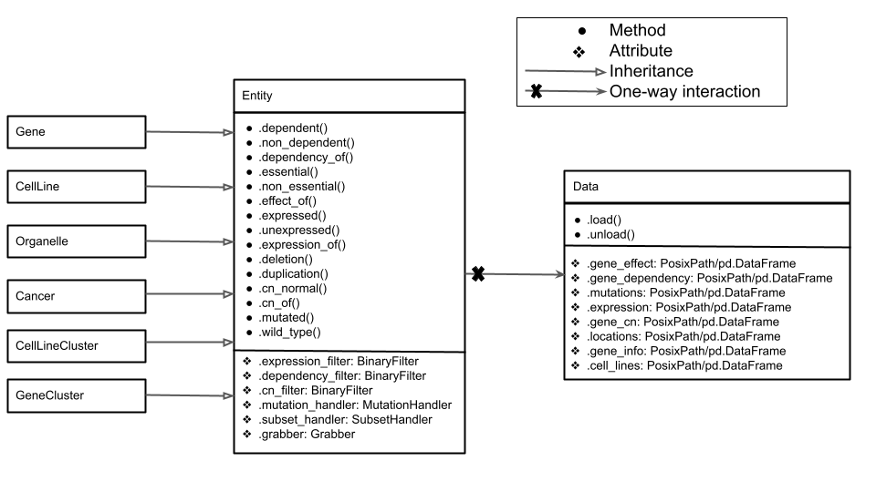

Module Structure:
=======================
The CanDI data integrator is a python library built on top of the Pandas that is specialized in integrating the publicly available data from:

- The Cancer Dependency Map
- The Cancer Cell Line Encyclopedia
- The Comprehensive Resource of Mammalian Protein Complexes (CORUM)
- Protein localization data from The Cell Atlas
- The Map of the Cell
- The In Silico Surfaceome

Access to all datasets is controlled via a python class called Data. Upon import the data class reads the config file established during installation and defines unique paths to each dataset and automatically loads the cell line index table and the gene index table.
Installation of CanDI, configuration, and data retrieval is handled by a manager class that is accessed indirectly through installation scripts and the Data class.
Interactions with this data are controlled through a parent Entity class and several handlers.
The biologically relevant abstraction classes (Gene, CellLine, Cancer, Organelle, GeneCluster, CellLineCluster) inherit their methods from Entity. Entity methods are wrappers for hidden data handler classes who perform specific transformations, such as data indexing and high throughput filtering.

CanDI.candi module
------------------
`Link to candi_module.pdf file <https://github.com/GilbertLabUCSF/CanDI/blob/docs/docs/candi_module.pdf>`_
.. automodule:: CanDI.candi.candi
   :members:
   :undoc-members:
   :show-inheritance:

CanDI.data module
------------------
The data class is instantiated at import. This class contains paths to all data downloaded with CanDI.
It has internal methods for loading datasets into memory as pandas dataframes.
There are 3 index tables that candi relies on for fetch all data:

- cell_lines
- genes
- locations

These tables are automatically loaded as pandas dataframes upon import of CanDI
It is highly recommended the user familiarize themself with the columns and indexes of these tables.
All candi classes operate through these index tables.

.. automodule:: CanDI.candi.data
   :members:
   :undoc-members:
   :show-inheritance:
