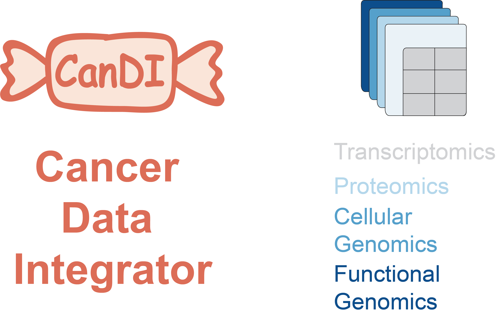

.. CanDI documentation master file, created by
   sphinx-quickstart on Wed May 26 13:53:57 2021.
   You can adapt this file completely to your liking, but it should at least
   contain the root `toctree` directive.

Welcome to CanDI's documentation!
=================================
.. toctree::
   :maxdepth: 2
   :caption: Contents:

   README

.. toctree::
   :maxdepth: 4
   :caption: Package:

   CanDI

.. toctree::
   :maxdepth: 2
   :caption: Notebooks:

   get-started.ipynb
   brca_heatmap.ipynb
   kras_egfr_scatter.ipynb
   deseq_setup.ipynb

Indices and tables
==================

* :ref:`genindex`
* :ref:`modindex`
* :ref:`search`
